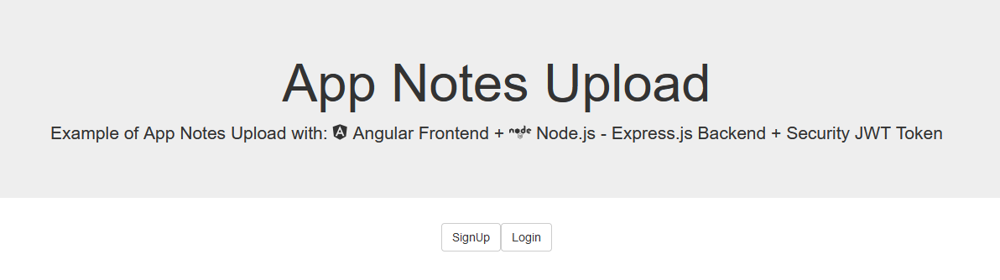
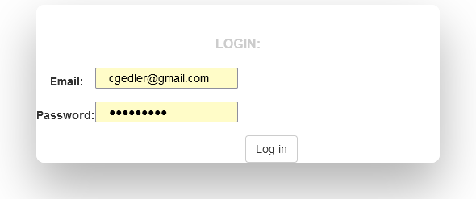
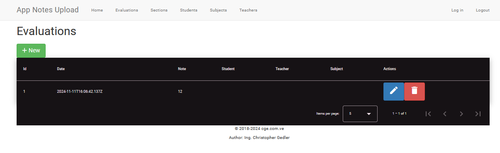
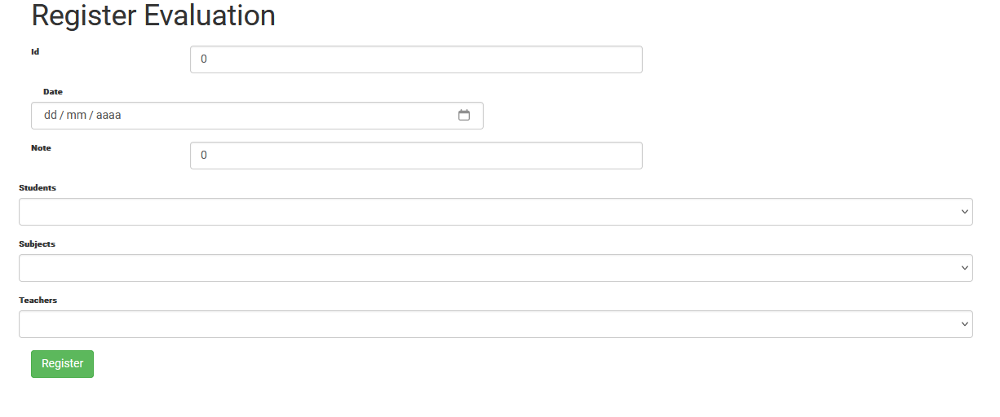
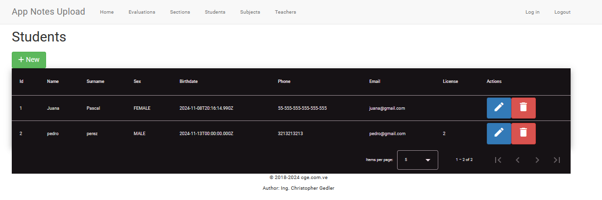
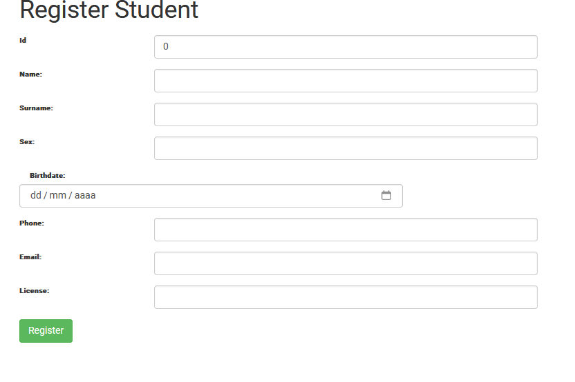
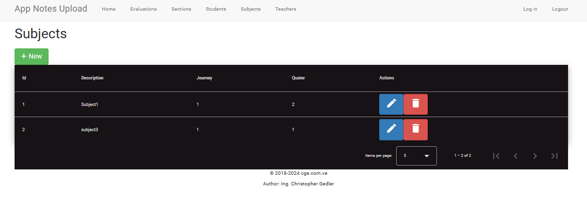
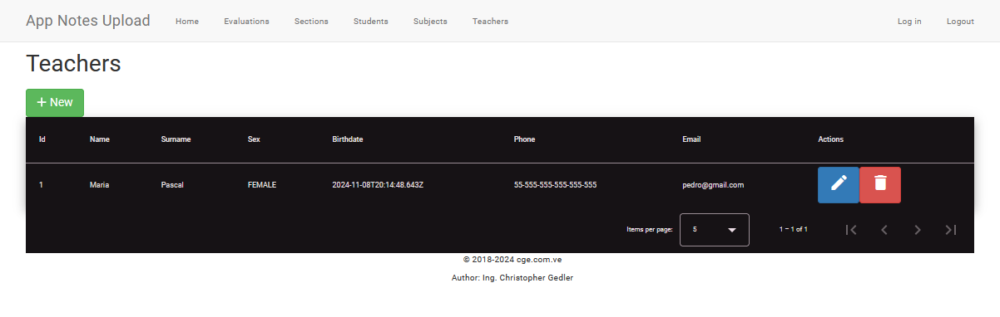
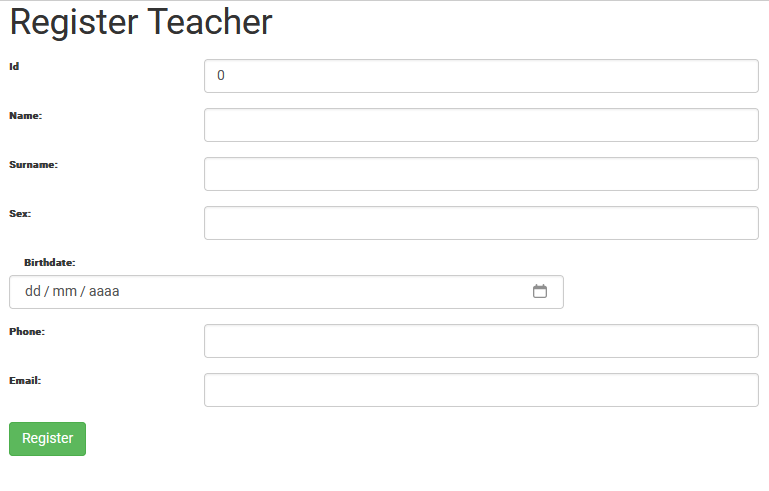

# AppNoteUpload-Front

## Descripci&#243;n general

### Nombre del Proyecto: Sistema de Gesti&#243;n de Notas de Estudiantes

### Tecnolog&#237;as Utilizadas:

- **Frontend:** Angular 18

- **Backend:** Node.js con Express

- **Base de Datos:** MSSQL

- **Autenticaci&#243;n:** JWT (JSON Web Tokens) para la autenticaci&#243;n de usuarios

- **Cifrado de Contrase&#241;as:** bcrypt

## Funcionalidades Principales

1. Registro y Autenticaci&#243;n de Usuarios:

- Los usuarios pueden registrarse y autenticarse.

- Se utiliza bcrypt para cifrar las contrase&#241;as antes de almacenarlas en la base de datos.

- JWT se utiliza para generar tokens de autenticaci&#243;n, permitiendo a los usuarios acceder a rutas protegidas.

2. Gesti&#243;n de Notas de Estudiantes (CRUD):

- **Crear:** Permite a los usuarios a&#241;adir nuevas notas de estudiantes.

- **Leer:** Los usuarios pueden ver una lista de todas las notas registradas.

- **Actualizar:** Los usuarios pueden editar las notas existentes.

- **Eliminar:** Los usuarios pueden eliminar notas que ya no son necesarias.

> Este proyecto representa una aplicaci&#243;n completa de gesti&#243;n de notas de estudiantes, con un backend en **Node.js** y **Express** que se comunica con un frontend en Angular 18. La aplicaci&#243;n permite a los usuarios registrar, ver, actualizar y eliminar notas de estudiantes.

# Screenshots

