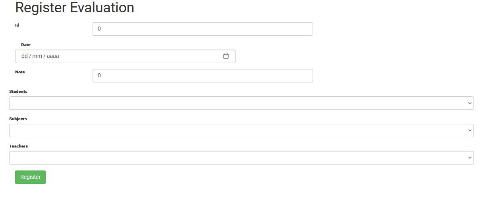
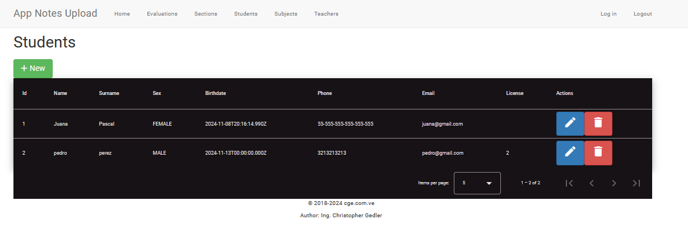
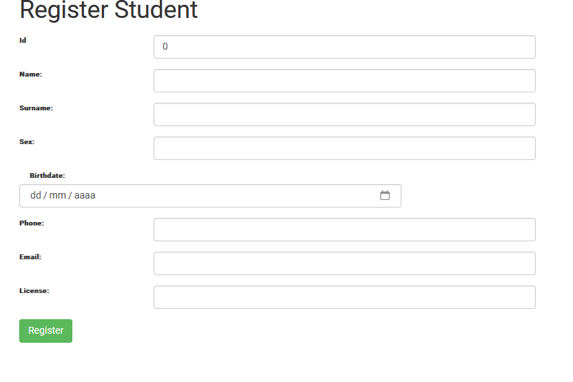
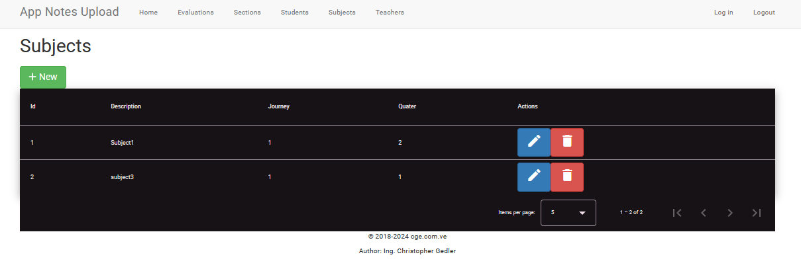
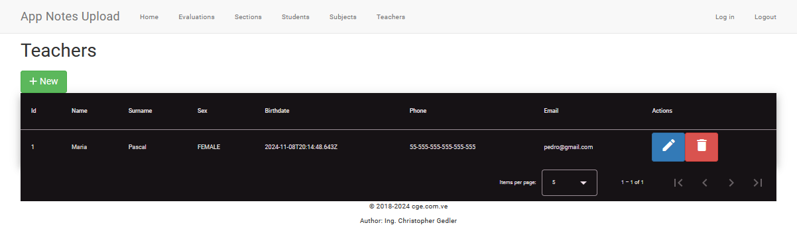

# AppNoteUpload-Front

## Overview

### Project Name: Student Grade Management System

### Technologies Used:

- **Interface:** Angular 18
- **Backend:** Node.js with Express
- **Database:** MSSQL
- **Authentication:** JWT (JSON Web Tokens) for user authentication
- **Password Encryption:** bcrypt

## Main Features

**1. User Registration and Authentication:**

- Users can register and authenticate.
- bcrypt is used to encrypt passwords before storing them in the database.
- JWT is used to generate authentication tokens, allowing users to access protected routes.

**2. Student Grade Management (CRUD):**

- **Create:** Allows users to add new student notes.
- **Read:** Users can view a list of all recorded notes.
- **Update:** Users can edit existing notes.
- **Delete:** Users can delete notes that are no longer needed.

> This project represents a complete student notes management application, with a backend in Node.js and Express that communicates with a frontend in Angular 18. The application allows users to record, view, update and delete student notes.

# Screenshots

